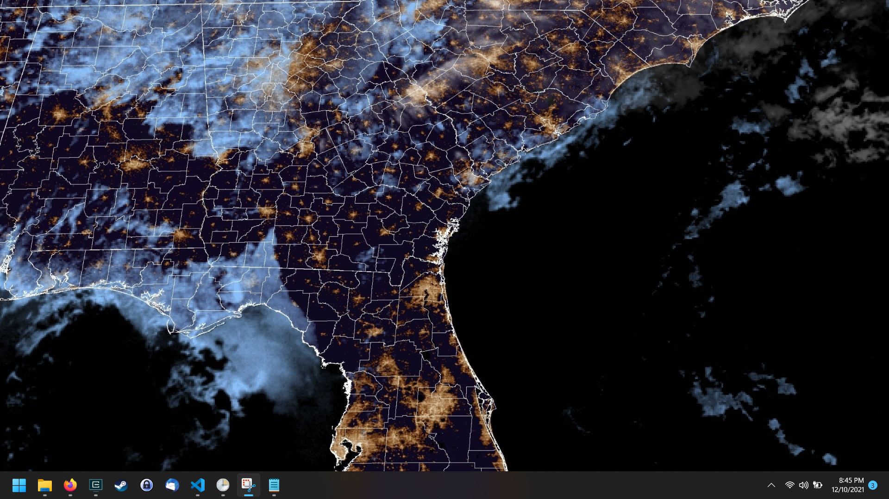
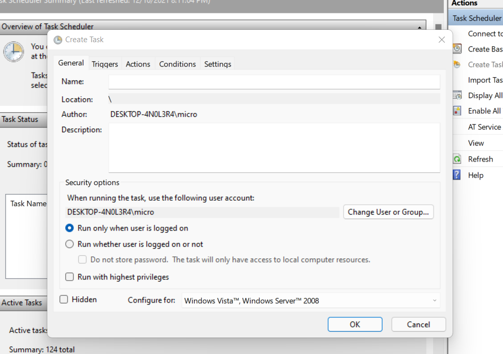
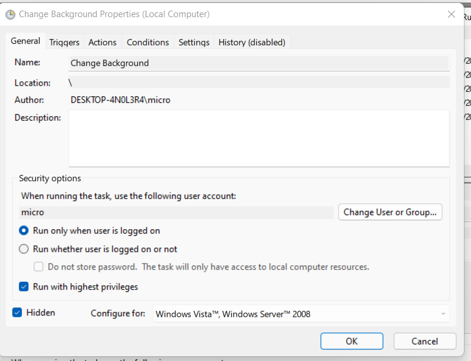
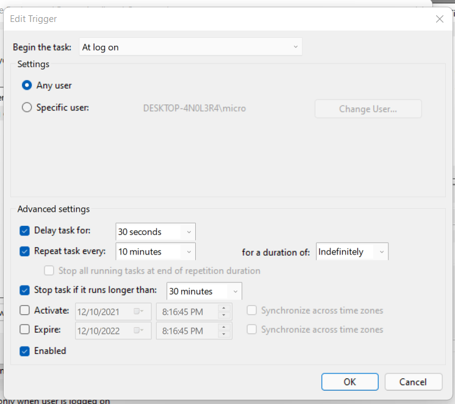
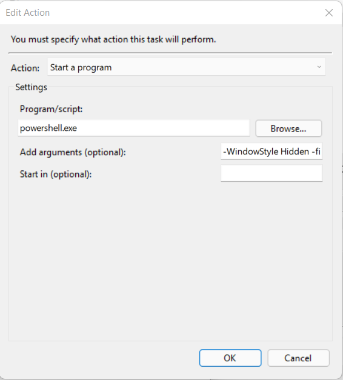

# satellite-background
This powershell script Gets the latest image of the Southeast USA from the GOES satellite and sets it as your background. Only tested for Windows 11.

## How to set it up
1. Place the desktop-changer.ps1 somewhere on your local PC.
2. Open up the Task Scheduler (Search for Task Scheduler in the start menu) and create a new task.

3. On my personal PC, I enabled this to run with highest privileges and run hidden

4. Go to the triggers tab and configure a new at log on trigger like as follows

5. Go to actions and create a new Run a program action. Configure it with the following:
    * Program/Script: powershell.exe
    * Arguments: -WindowStyle Hidden -file "Path\To\Script\desktop-changer.ps1"

6. Either log off and log in again, or manually run the script to have it run the first time
7. Enjoy!

## Notes

* The script takes about a minute to complete due to the web call being slow and the image taking a while to download
* Your background performs best when you hav the image set to fill.

## Future Improvements

* Enable multiple regions or map types with arguments
* Make the call more performant
* Make the Background image setting configurable
* Automate the creation of a task if one doesn't exist